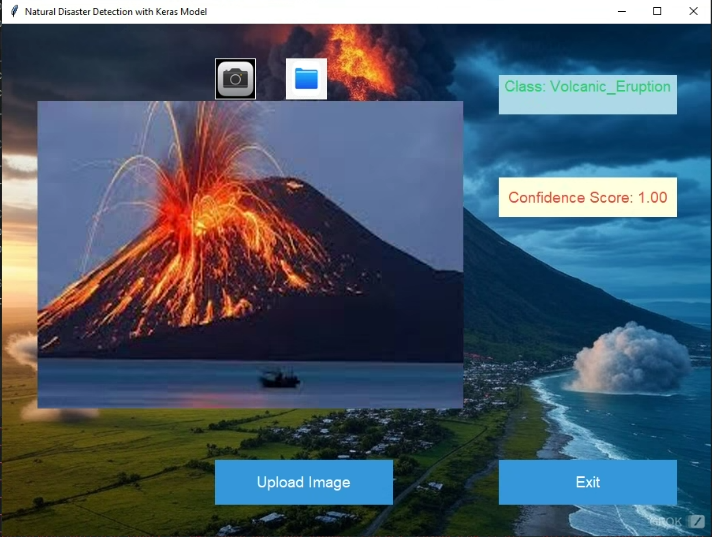
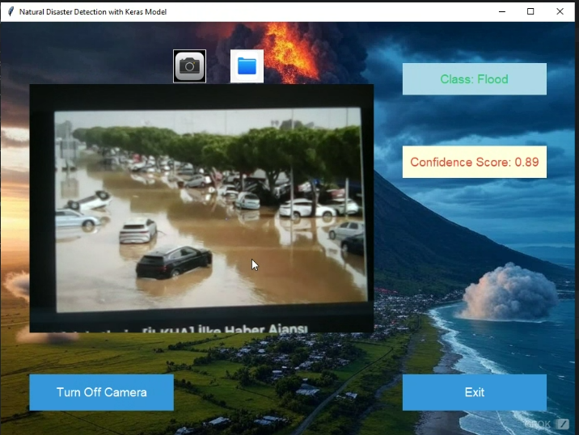
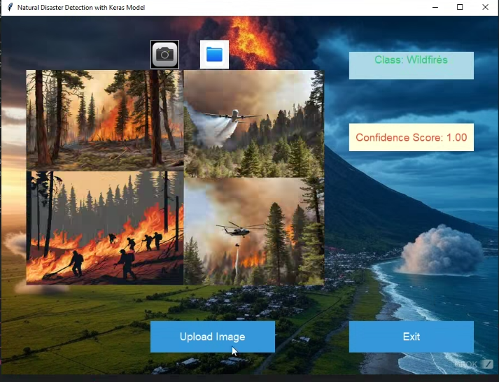
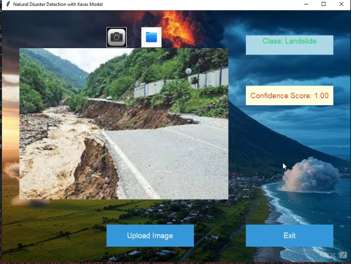
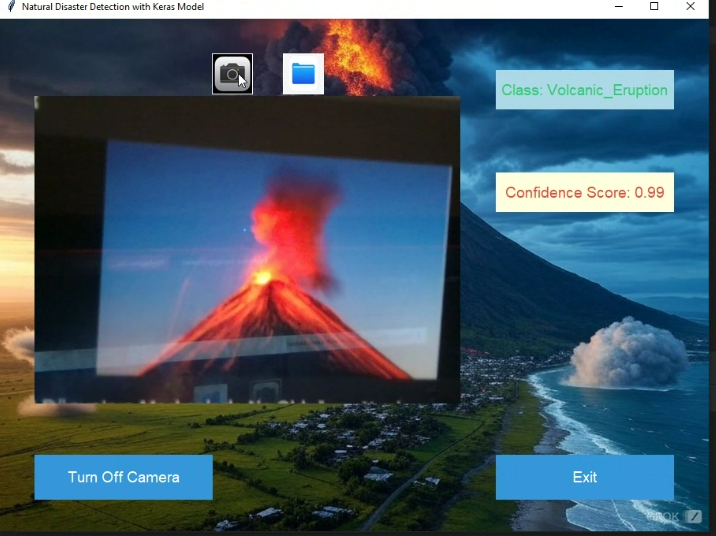
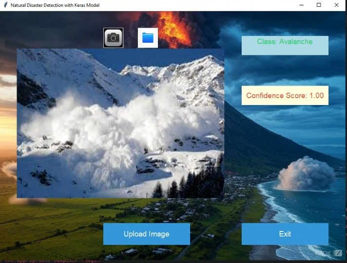
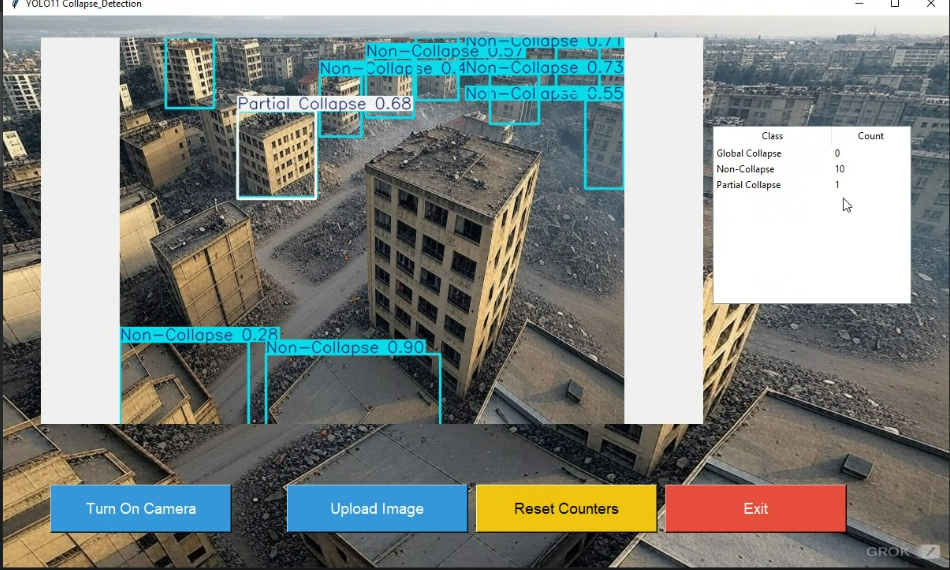
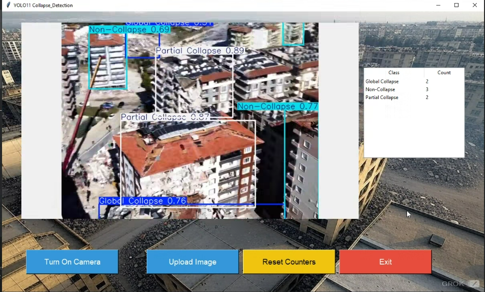
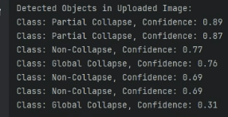
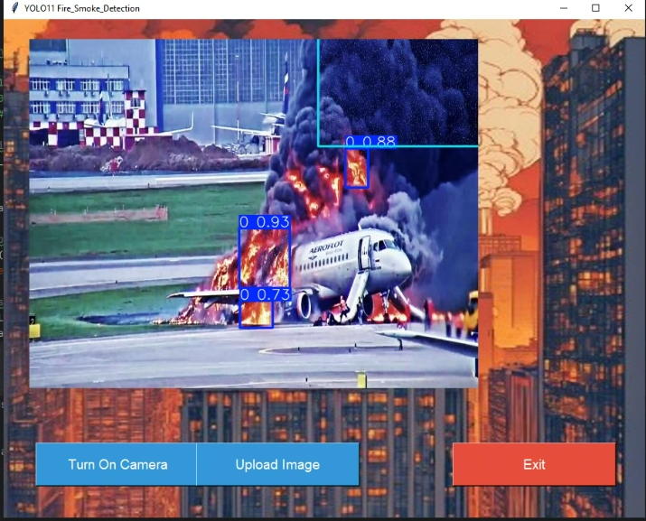

# Disaster & Building Collapse Detection Models

---

## ⚙️ Tekch Stack

---

## Table of Contents
- [Overview](#overview)
- [Models](#models)  
  - [Natural Disaster Detection](#natural-disaster-detection-model)  
  - [Building Collapse Detection](#building-collapse-detection-model)  
  - [Fire Detection](#fire-detection-model)  
- [License](#license)
- [Contact](#contact)

---

## Overview
This repository contains three computer-vision models for real-time detection and classification tasks:

1. **Natural Disaster Detection Model** – identifies events like volcanoes, avalanches, floods, wildfires, earthquakes, landslides, tsunamis, etc., by combining YOLOv11 with MobileNetV2 and ResNet50 heads.    
2. **Building Collapse Detection Model** – finds and classifies collapsed vs. intact structures by using YOLOv11.
3. **Fire Detection Model** – specifically detects active fires in images/video streams using YOLOv11.

---

## Models

### Natural Disaster Detection Model
- **Architecture**: YOLOv11  
- **Input**: Single images or video frames  
- **Output**: Bounding boxes + class labels for each disaster type  
- **Classes**:  
  - Volcano  
  - Avalanche  
  - Flood  
  - Wildfire  
  - Earthquake fault rupture  
  - Landslide  
  - Tsunami  
  - …and more  
- **Dataset**:  
  - Aggregated from public sources (NASA, USGS, NOAA) and web-scraped images, generated images by using stable diffusion and annotated in COCO format.
 - **Workflow**:  
  1. YOLOv11 proposes bounding boxes around building regions.  
  2. Cropped regions are passed to MobileNetV2 or ResNet50 classifiers to confirm “Collapsed” vs. “Intact.”
- **Key Features**:  
  - Real-time inference (~45 FPS on a GTX 1080 Ti)  
  - Non-maximum suppression to reduce duplicates  
  - Adjustable confidence threshold via CLI/API  

### Building Collapse Detection Model
- **Detection Backbone**: YOLOv11 for coarse localization     
- **Dataset**:  
  - https://universe.roboflow.com/metehan-kandemir/collapse-detector
  - This dataset was collected and prepared by Metehan Kandemir as part of a civil engineering graduation project. Its purpose is to assess the collapse status of buildings, categorized as Partial Collapse,    Global Collapse, or Non-Collapse.
- **Transfer Learning**:  
  - Base networks pretrained on ImageNet, fine-tuned on collapse dataset (224×224 inputs, batch size 32).

### Fire Detection Model
- **Architecture**: YOLOv11  
- **Input**: Images or video streams  
- **Output**: Bounding boxes around active fire regions  
- **Classes**:  
  - Fire  
- **Dataset**:  
  - https://universe.roboflow.com/anaworkspace/fire_smoke_detection-bqivj/dataset/1
- **Key Features**:  
  - Real-time inference (~45 FPS on a GTX 1080 Ti)  
  - Tunable confidence threshold  
  - Robust to smoke and varied lighting  

---

## 📸 Screenshots

Here are some example outputs from the models:

### Natural Disaster Detection
  
*Volcano detected in aerial imagery.*

  
*Flooded area highlighted.*

  
*Detected blaze in urban environment.*

  
*Detected lanslide on the side of the road.*

  
*Detected volcanic eruption on live feed.*

  
*Detected avalanche on a mountain.*

  
*Detected drought in a desert environment.*

--- 

### Building Collapse Detection
  
*Detected collapse on building façade.*

  
*Correctly classified intact structure.*

  
*Classes and their confidence score according to predicted classes of collapse.*

### Fire Detection
  
*Detected active fire on a plane.*

---

### License

This project is licensed under the MIT License. See LICENSE for details.

---

### Contact
- For questions or support, please reach out to:

Email: oguzyucell.oy@gmail.com

